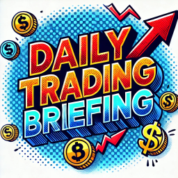
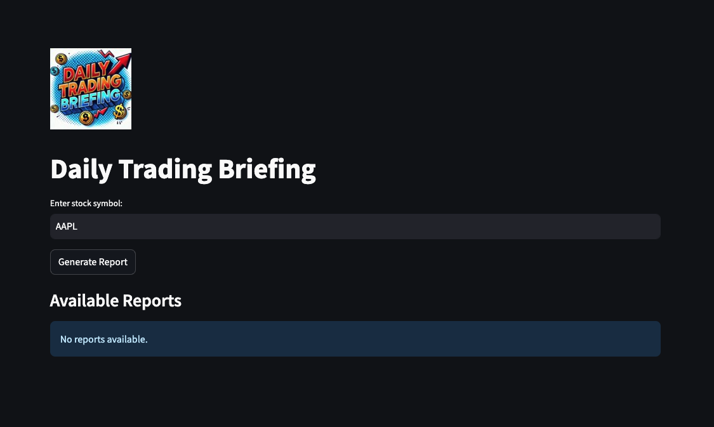
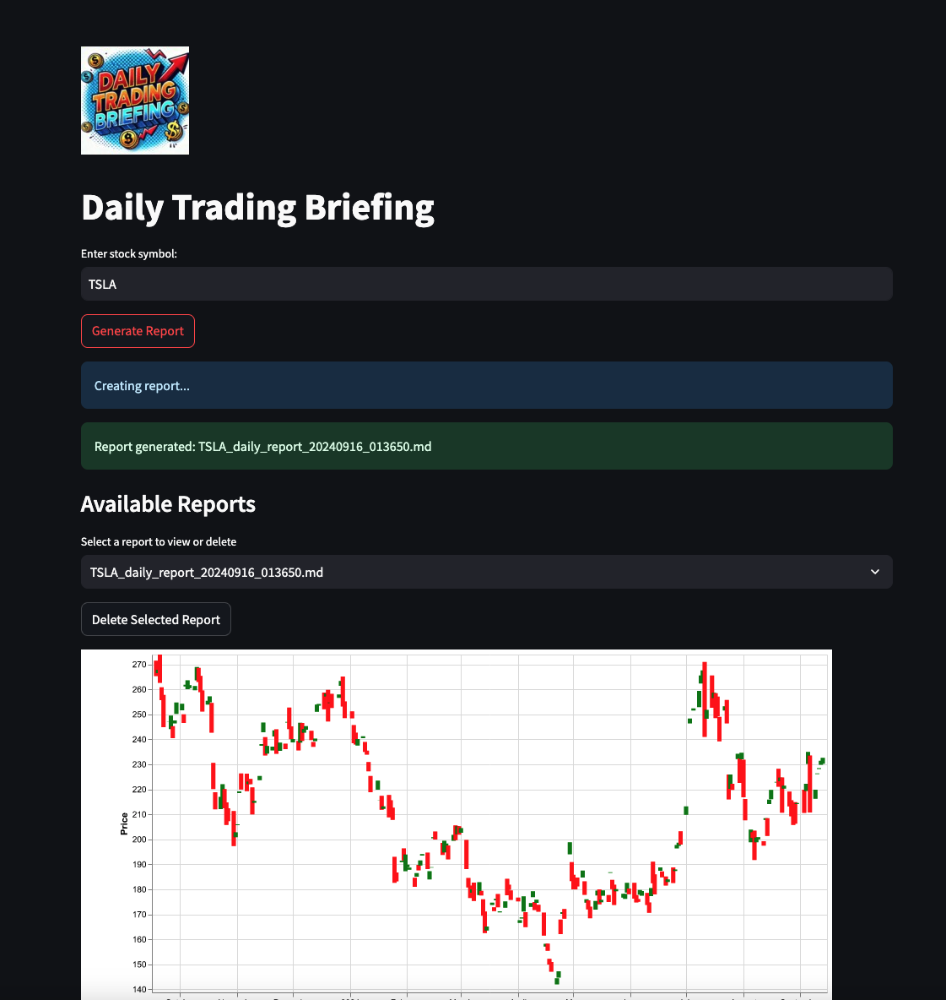
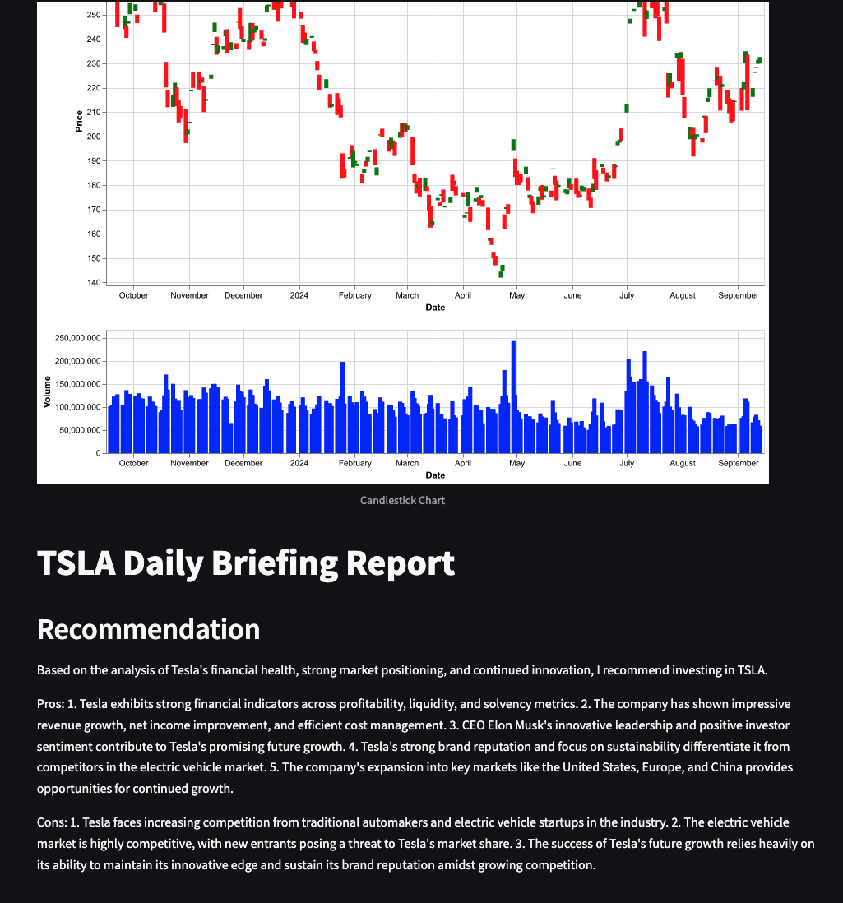

# Daily Trading Briefing

**A Walkthrough for Hackathon Submission**

## Introduction

The Daily Trading Briefing tool facilitates and automates stock research with the help of agent frameworks (Crew AI). Instead of manually conducting web research, different reports and news are collected, evaluated, and aggregated by AI agent teams. This includes a simple display of the chart and Crew AI-based research for the stock, including a recommendation based on pros and cons.

This is a prototype, and in future versions, more data can be included (like fundamental numbers of the company) and possibly automated technical chart analysis for proper timing of a possible trade. The project aims to assist in making data-driven decisions for the stock market.

## Overview of the Tool

### Project Description
The Daily Trading Briefing tool allows users to enter a stock symbol and generate detailed reports. The tool uses Streamlit for the interface and Crew AI for aggregating and analyzing stock information. Key technologies include:

- **Streamlit**: For building the interactive interface.
- **Crew AI**: For data collection, evaluation, and aggregation.
- **Composio**: Used in data processing and analysis.

### Features

- **Input Stock Symbol**: Users can input any stock symbol and generate a report based on the latest data.
- **Generate Reports**: The tool generates reports that include candlestick charts, volume analysis, and AI-driven recommendations.
- **Manage Reports**: Users can view, open, or delete previously generated reports.

## Walkthrough of the Application

### Step 1: Enter Stock Symbol
Users can enter a stock symbol in the input field and click on 'Generate Report' to create a new report.

### Step 2: Viewing Available Reports
Generated reports are displayed in the 'Available Reports' section, where users can view or delete them.

### Step 3: Generated Report
Each report includes a candlestick chart, volume analysis, and a recommendation based on the AI's evaluation.

## Behind the Scenes

The tool uses Crew AI agents for collecting, evaluating, and aggregating stock-related data from various sources. The AI framework processes this information to generate reports that include market analysis, trends, and recommendations.

## Conclusion

The Daily Trading Briefing tool is a prototype that demonstrates the potential of AI-driven decision-making in stock trading. Future developments could include more advanced data analysis and integration with additional financial metrics.

## Contact Information

For more information or to access the code, please contact the project team.

---

### Author

**Simon Aumayer**

### License

This project is licensed under the MIT License - see the [LICENSE](LICENSE) file for details.

### Acknowledgments

- Thanks to the open-source community for the libraries and tools used in this project.
